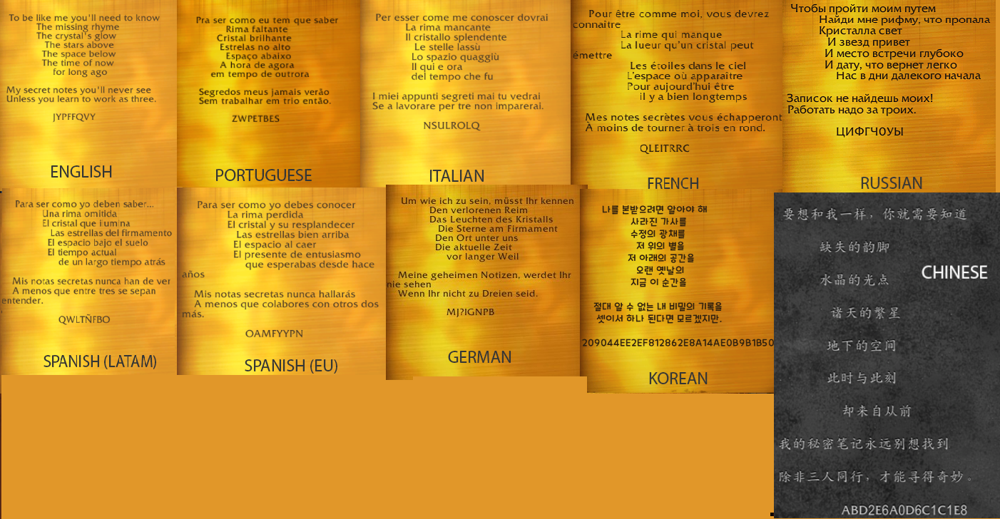

# WoW Ratts' revenge secret - 9 o'clock analysis

- [Wowhead](https://www.wowhead.com/guide/secrets/ratts-revenge-incognitro-felcycle-guide)

This repositories uses language worrd lists to match letter frequencies and word length across localizations used in the Cryptic Plaque.



Analyzed on:

```
'en': 'JYPFFQVY'
'de': 'MJ?IGNPB' // ? = ß
```

> NOTE: Noticed handles frequency list not entirely correct - it still gives a good example of possible words

## Output

Results of analysis can be found in the `data/output/` folder

## Process

1. Take all words of the same length as encrypted word in that localization
2. Take all words with same letter frequencies as encrypted word in that localization
3. Find translations from english to localization and find translated words that match with the letter frequencies and length in that localization

## Sources

- https://github.com/dwyl/english-words
- https://github.com/Jonny-exe/German-Words-Library
